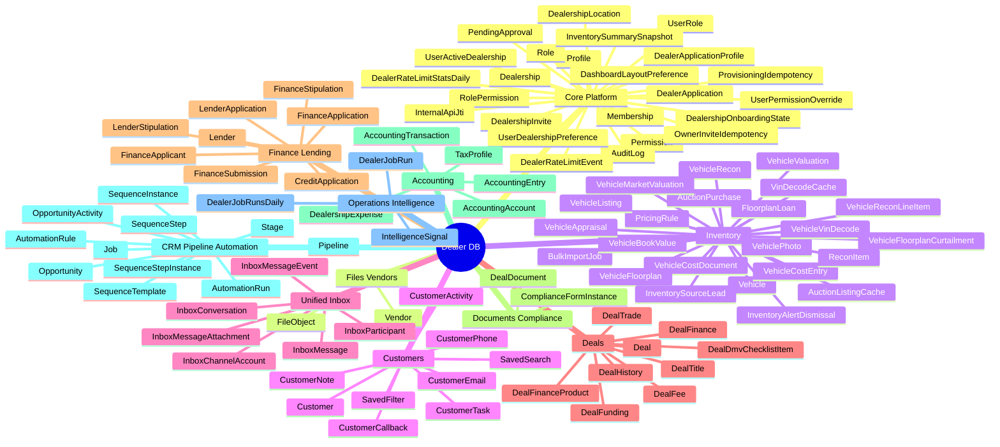
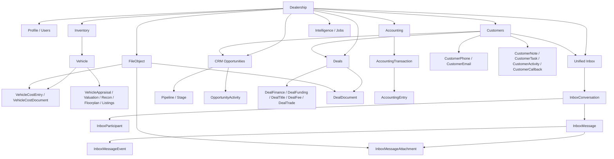

# Dealer Database Work Tree

Generated from the current Prisma schema in [schema.prisma](/Users/saturno/Downloads/dms/apps/dealer/prisma/schema.prisma).

Current scope:
- `102` models
- dealer app schema only
- grouped by domain so the tree stays readable

## Work Tree

## System Spine

## Domain Breakdown

### Core Platform
- `Dealership`
- `DealershipOnboardingState`
- `DealershipLocation`
- `Profile`
- `DealershipInvite`
- `PendingApproval`
- `DealerApplication`
- `DealerApplicationProfile`
- `Permission`
- `Role`
- `RolePermission`
- `Membership`
- `UserActiveDealership`
- `UserRole`
- `UserPermissionOverride`
- `AuditLog`
- `DashboardLayoutPreference`
- `InventorySummarySnapshot`
- `UserDealershipPreference`
- `ProvisioningIdempotency`
- `InternalApiJti`
- `DealerRateLimitEvent`
- `DealerRateLimitStatsDaily`
- `OwnerInviteIdempotency`

### Files / Vendors
- `Vendor`
- `FileObject`

### Inventory
- `Vehicle`
- `VehiclePhoto`
- `VehicleCostEntry`
- `VehicleCostDocument`
- `BulkImportJob`
- `InventoryAlertDismissal`
- `VehicleVinDecode`
- `VehicleValuation`
- `VehicleRecon`
- `VehicleReconLineItem`
- `VehicleFloorplan`
- `VehicleFloorplanCurtailment`
- `VinDecodeCache`
- `VehicleBookValue`
- `VehicleAppraisal`
- `InventorySourceLead`
- `AuctionListingCache`
- `AuctionPurchase`
- `VehicleMarketValuation`
- `PricingRule`
- `VehicleListing`
- `ReconItem`
- `FloorplanLoan`

### Customers
- `Customer`
- `SavedFilter`
- `SavedSearch`
- `CustomerPhone`
- `CustomerEmail`
- `CustomerNote`
- `CustomerTask`
- `CustomerActivity`
- `CustomerCallback`

### Unified Inbox
- `InboxConversation`
- `InboxParticipant`
- `InboxMessage`
- `InboxMessageAttachment`
- `InboxMessageEvent`
- `InboxChannelAccount`

### Deals
- `Deal`
- `DealTitle`
- `DealDmvChecklistItem`
- `DealFee`
- `DealTrade`
- `DealHistory`
- `DealFunding`
- `DealFinance`
- `DealFinanceProduct`

### Finance / Lending
- `Lender`
- `FinanceApplication`
- `FinanceApplicant`
- `FinanceSubmission`
- `FinanceStipulation`
- `CreditApplication`
- `LenderApplication`
- `LenderStipulation`

### Documents / Compliance
- `DealDocument`
- `ComplianceFormInstance`

### Accounting
- `AccountingAccount`
- `AccountingTransaction`
- `AccountingEntry`
- `DealershipExpense`
- `TaxProfile`

### CRM / Pipeline / Automation
- `Pipeline`
- `Stage`
- `Opportunity`
- `OpportunityActivity`
- `AutomationRule`
- `AutomationRun`
- `Job`
- `SequenceTemplate`
- `SequenceStep`
- `SequenceInstance`
- `SequenceStepInstance`

### Operations / Intelligence
- `DealerJobRun`
- `DealerJobRunsDaily`
- `IntelligenceSignal`

## Main Ownership Rules

- `Dealership` is the root tenant boundary for almost every model.
- `Profile` is the user/actor identity for assignments, ownership, audit, and workflow actions.
- `Customer`, `Vehicle`, and `Opportunity` are the main operational entities.
- `Deal` is the commercial closing record that joins customer + vehicle + finance flows.
- `InboxConversation` and `InboxMessage` are now the canonical communication layer.
- `CustomerActivity` remains the CRM timeline projection layer.

## Highest-Value Relationship Chains

1. Inventory path
   `Dealership -> Vehicle -> VehicleCostEntry / VehicleAppraisal / VehicleRecon / VehicleListing / VehiclePhoto`

2. Customer sales path
   `Dealership -> Customer -> Opportunity -> Deal`

3. Inbox path
   `Dealership -> InboxConversation -> InboxMessage -> InboxMessageEvent`

4. Finance path
   `Deal -> DealFinance -> FinanceApplication -> FinanceSubmission -> FinanceStipulation`

5. Accounting path
   `Dealership -> AccountingTransaction -> AccountingEntry`

If you want, the next useful artifact is a second file with a true ER diagram for only the main operational models:
- `Customer`
- `InboxConversation`
- `Opportunity`
- `Vehicle`
- `Deal`
- `AccountingTransaction`

That one would be much better for implementation work than trying to render all `102` models as one ER graph.
