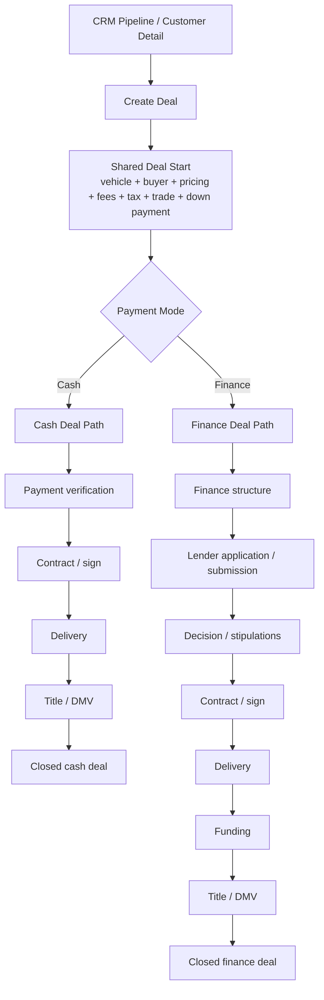

# Deal Sales Flow UI Rewrite Spec

## Goal
Rewrite the sales UI flow so cash and finance deals share one coherent deal spine, then branch only where the operational work actually differs.

The target outcome is:
- one clear handoff from CRM into Deal
- one shared deal start
- two explicit execution branches:
  - cash sale
  - finance sale
- one shared closeout spine for delivery and title

This should make the UI feel like one orchestrated selling workflow instead of a set of adjacent modules.

---

## Current System Mapping

The current backend/domain model already supports the right business flow:
- `Customer` and `Opportunity` drive pre-deal qualification
- `Deal` is the transactional spine
- `DealFinance` and lender models drive finance-specific work
- `DealFunding` is downstream and finance-specific
- `DealTitle` and `DealDmvChecklistItem` drive title/DMV operations
- `deliveryStatus` on `Deal` drives delivery progression

Current major UI surfaces:
- CRM pipeline: `/crm/opportunities`
- Customer detail: `/customers/profile/[id]`
- New deal: `/deals/new`
- Deal workspace / desk: `/deals/[id]`
- Delivery queue: `/deals/delivery`
- Funding queue: `/deals/funding`
- Title queue: `/deals/title`

The core issue is not the backend flow. The issue is that the UI does not yet make the cash-vs-finance branch explicit enough.

---

## Target Workflow



---

## Screen-by-Screen Rewrite

### 1. CRM -> Deal handoff
Current surfaces:
- `/crm/opportunities`
- `/customers/profile/[id]`

Required change:
- the CTA that starts the sale must feel like a clear transition into a deal workflow, not just a generic route jump
- primary CTA language should be consistent:
  - `Start deal`
  - not mixed with `Create deal`, `Open deal`, `Desk`, depending on surface

Recommended UI behavior:
- from opportunity or customer context, launch `/deals/new` with:
  - customer preselected
  - optionally vehicle preselected if the user came from inventory
- show a compact sell-flow preview:
  - `Customer`
  - `Vehicle`
  - `Payment mode`

### 2. New Deal
Current surface:
- `/deals/new`

New responsibility:
- bind customer + vehicle
- choose payment mode early
- establish the initial deal spine

Required change:
- `Payment mode` becomes a first-class decision at create time
- choices:
  - `Cash`
  - `Finance`

This choice should immediately shape the downstream flow and progress strip.

UI rules:
- keep the new-deal screen compact
- do not overload it with full finance workflow inputs
- it should answer only:
  - who is buying
  - what vehicle
  - what type of deal this is

### 3. Shared Deal Start
Current surface:
- `/deals/[id]`
- current Deal Desk behavior

New responsibility:
- hold shared transaction math only

Shared fields:
- sale price
- taxes
- doc fee
- additional fees
- trade allowance / payoff
- down payment
- notes

Not shared:
- lender workflow
- stipulations
- funding operations

Required change:
- the desk should stop behaving like the entire post-opportunity workflow
- after shared desk math, the user should be routed into:
  - `Cash execution`
  - `Finance execution`

### 4. Cash Deal Path
Target surfaces:
- deal workspace in cash mode
- delivery
- title

Cash-specific steps:
- confirm payment / deposit
- contract complete
- delivery
- title/DMV

Required change:
- cash deals should not show finance/funding as required progression states
- funding should be hidden or marked `Not required`

Cash progress strip:
- `Customer`
- `Vehicle`
- `Desk`
- `Payment`
- `Delivery`
- `Title`
- `Closed`

### 5. Finance Deal Path
Target surfaces:
- deal workspace in finance mode
- finance shell
- delivery
- funding
- title

Finance-specific steps:
- finance structure
- lender application
- decision
- stipulations
- contract
- delivery
- funding
- title/DMV

Required change:
- finance should become a first-class deal stage, not a side tab that competes with everything else equally
- funding should appear only for finance deals

Finance progress strip:
- `Customer`
- `Vehicle`
- `Desk`
- `Finance`
- `Approval`
- `Delivery`
- `Funding`
- `Title`
- `Closed`

### 6. Delivery
Current surface:
- `/deals/delivery`

New responsibility:
- a shared post-contract execution stage for both cash and finance deals

Required change:
- delivery should visually read as the common downstream step after contract
- it should not feel like a detached queue unrelated to the deal journey

### 7. Funding
Current surface:
- `/deals/funding`

New responsibility:
- finance-only closeout stage

Required change:
- cash deals must not look blocked by funding
- funding queue and funding panels must be suppressed for cash deals

### 8. Title / DMV
Current surface:
- `/deals/title`

New responsibility:
- final shared operational closure

Required change:
- title should sit after delivery for cash
- after funding for finance
- progress messaging should reflect that difference

---

## UI Behavior Spec

### Shared deal shell
Every deal should show:
- customer
- vehicle
- payment mode
- current stage
- blockers
- next best action

### Conditional sections

Cash deal:
- show:
  - desk math
  - payment confirmation
  - delivery
  - title
- hide:
  - lender submission details
  - funding workflow
  - stipulation stack

Finance deal:
- show:
  - desk math
  - finance structure
  - lender workflow
  - stipulations
  - funding
  - title

### Status model

Shared base statuses:
- `DRAFT`
- `STRUCTURED`
- `ACCEPTED`
- `CONTRACTED`

Cash operational overlay:
- `PAYMENT_PENDING`
- `READY_FOR_DELIVERY`
- `DELIVERED`
- `TITLE_PENDING`
- `CLOSED`

Finance operational overlay:
- `FINANCE_PENDING`
- `SUBMITTED`
- `CONDITIONAL`
- `CONTRACTED`
- `READY_FOR_DELIVERY`
- `DELIVERED`
- `FUNDING_PENDING`
- `FUNDED`
- `TITLE_PENDING`
- `CLOSED`

Note:
- no DB rewrite is required to start the UI rewrite
- this overlay can be derived from existing `Deal`, `DealFinance`, `DealFunding`, `DealTitle`, and `deliveryStatus`

---

## Navigation Rewrite

### Current problem
The current UI makes these modules feel separate:
- deal desk
- finance
- delivery
- funding
- title

### Target navigation

Cash deal:
```text
Deal Overview -> Desk -> Payment -> Delivery -> Title
```

Finance deal:
```text
Deal Overview -> Desk -> Finance -> Approval -> Delivery -> Funding -> Title
```

### Recommended implementation
- keep one canonical deal route: `/deals/[id]`
- use the deal route as the guided deal workspace
- queues remain as operational list pages, but clicking a row should always return into the deal workspace with the right section focused

Examples:
- funding queue row -> `/deals/[id]?focus=funding`
- title queue row -> `/deals/[id]?focus=title`
- delivery queue row -> `/deals/[id]?focus=delivery`

---

## Visual UI Mock

### Shared start

```text
┌──────────────────────────────────────────────────────────────────────────────┐
│ DEAL WORKSPACE                                               [Close / Exit] │
│ Customer: John Smith     Vehicle: 2021 Honda Civic     Mode: Finance        │
│ Deal stage: Desk ready                                                  2/8 │
├──────────────────────────────────────────────────────────────────────────────┤
│ [Customer] [Vehicle] [Desk] [Finance] [Approval] [Delivery] [Funding] [Title]│
├──────────────────────────────────────────────────────────────────────────────┤
│ Left: deal math workspace                 Right: next action / blockers      │
│                                                                              │
│ Sale price   Taxes   Fees   Trade   Down payment                             │
│                                                                              │
│ After save: route user into the mode-specific track                          │
└──────────────────────────────────────────────────────────────────────────────┘
```

### Cash deal mock

```text
┌──────────────────────────────────────────────────────────────────────────────┐
│ CASH DEAL                                                     [Customer 424] │
│ 2020 Toyota Camry                                      Contracted            │
├──────────────────────────────────────────────────────────────────────────────┤
│ [Customer] [Vehicle] [Desk] [Payment] [Delivery] [Title] [Closed]           │
├──────────────────────────────────────────────────────────────────────────────┤
│ Main                                                                    Rail │
│ Payment confirmation                                                     │   │
│ Cash received                                                            │   │
│ Receipt / contract docs                                                  │   │
│ Ready for delivery                                                       │   │
│                                                                          │   │
│ Delivery checklist                                                       │   │
│ Title prep                                                               │   │
│                                                                          │   │
│                                     Next action: Mark ready for delivery │   │
│                                     Blockers: Missing signature          │   │
└──────────────────────────────────────────────────────────────────────────────┘
```

### Finance deal mock

```text
┌──────────────────────────────────────────────────────────────────────────────┐
│ FINANCE DEAL                                                  [Customer 424] │
│ 2020 Toyota Camry                                      Approval pending      │
├──────────────────────────────────────────────────────────────────────────────┤
│ [Customer] [Vehicle] [Desk] [Finance] [Approval] [Delivery] [Funding] [Title]│
├──────────────────────────────────────────────────────────────────────────────┤
│ Main                                                                    Rail │
│ Finance structure                                                         │   │
│ Term   APR   Amount financed   Backend products                           │   │
│                                                                          │   │
│ Lender submission                                                        │   │
│ Decision status                                                          │   │
│ Stipulations                                                             │   │
│                                                                          │   │
│ Delivery comes after contract                                            │   │
│ Funding comes after delivery                                             │   │
│                                                                          │   │
│                                     Next action: Upload stipulations     │   │
│                                     Blockers: Conditional approval       │   │
└──────────────────────────────────────────────────────────────────────────────┘
```

### Queue relationship mock

```text
┌───────────────┐     click row      ┌────────────────────────────┐
│ Funding Queue │ -----------------> │ Deal Workspace (funding)   │
└───────────────┘                    └────────────────────────────┘

┌───────────────┐     click row      ┌────────────────────────────┐
│ Title Queue   │ -----------------> │ Deal Workspace (title)     │
└───────────────┘                    └────────────────────────────┘

┌───────────────┐     click row      ┌────────────────────────────┐
│ Delivery Queue│ -----------------> │ Deal Workspace (delivery)  │
└───────────────┘                    └────────────────────────────┘
```

---

## Implementation Priority

### Phase 1
- make `payment mode` explicit in `/deals/new`
- make `/deals/[id]` show a mode-aware progress strip
- suppress funding complexity for cash deals

### Phase 2
- restructure deal workspace sections:
  - shared desk section
  - mode-specific execution section
  - shared closeout section

### Phase 3
- make queue rows deep-link back into focused deal sections
- align title, delivery, and funding with the guided workspace

---

## Success Criteria

- user can tell within seconds whether a deal is cash or finance
- cash deals no longer look overcomplicated by finance workflow
- finance deals no longer bury approval/funding behind generic tabs
- delivery/title feel like shared closeout stages
- queue pages feel like operational entry points into the same deal workspace, not separate products
