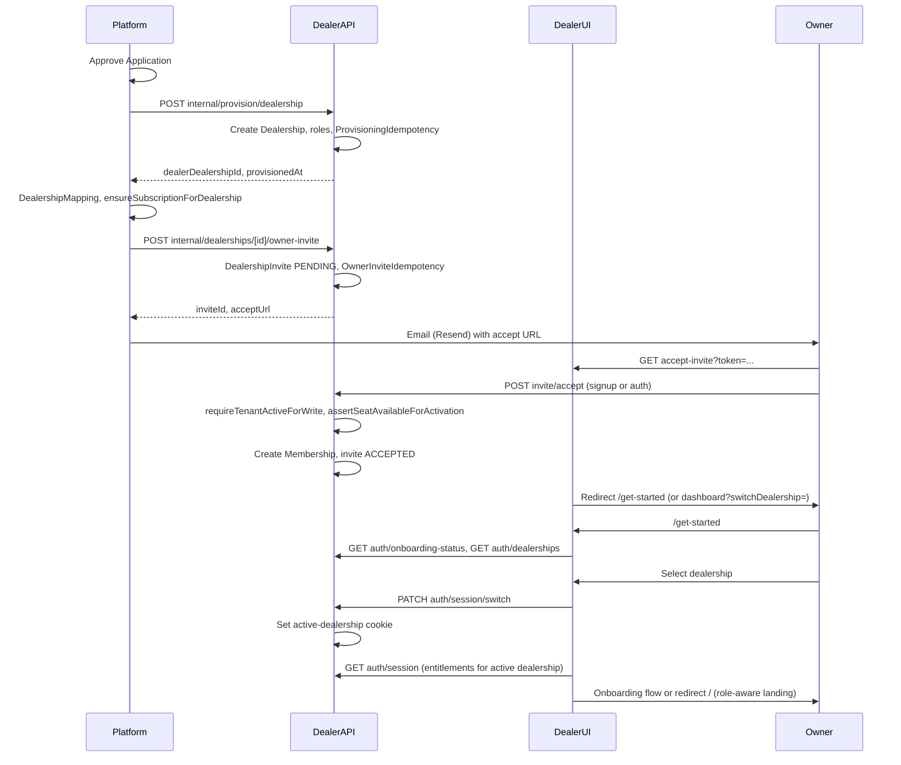

# Onboarding Flow (Platform → Dealer) — Canonical

**Status:** Implemented and code-backed.

This document describes the single end-to-end onboarding path that incorporates subscription, entitlements, and seat caps. It is the canonical reference for the hardened flow.

## Single path summary

1. **Application** → Platform approves application.
2. **Provision** → Platform calls dealer internal `POST /api/internal/provision/dealership`; dealer creates Dealership, roles, ProvisioningIdempotency. Platform stores DealershipMapping and creates **subscription** via `ensureSubscriptionForDealership` (subscription is created at provision time).
3. **Owner invite** → Platform calls dealer `POST /api/internal/dealerships/[id]/owner-invite`; dealer creates DealershipInvite (PENDING), OwnerInviteIdempotency; platform sends email with accept URL.
4. **Accept invite** → Owner opens accept URL; dealer `POST /api/invite/accept` (signup or authenticated). Dealer runs `requireTenantActiveForWrite` (blocks SUSPENDED/CLOSED) and **assertSeatAvailableForActivation** (returns 409 SEAT_LIMIT_REACHED when at cap); then creates Membership and marks invite ACCEPTED.
5. **Get-started** → User lands on `/get-started` (no active dealership) or redirect with switchDealership. Get-started loads onboarding-status and dealerships; user selects dealership.
6. **Session switch** → Client calls `PATCH /api/auth/session/switch`; server sets active-dealership cookie. Client refetches session so **entitlements** are loaded for the active dealership (GET /api/auth/session fetches entitlements from platform internal API when activeDealershipId is set).
7. **Onboarding or home** → If 6-step onboarding not complete, show onboarding flow; else redirect to `/` (role-aware landing). Nav hides modules not in `entitlements.modules`; route-level ModuleGuard shows "Module not included" for direct URL access to unlicensed modules where wrapped.

## Session and entitlements behavior

- **Entitlements** are read from the platform by the dealer: dealer session route calls `fetchEntitlementsForDealership(activeDealershipId)`, which uses platform `GET /api/internal/entitlements/[dealerDealershipId]` (internal JWT). No dealer schema stores subscription truth; platform is source of truth.
- **Session** returns `entitlements` only when `activeDealershipId` is set. On platform fetch failure, session returns `entitlements: null` (fail-open so dealer app remains usable when platform is unreachable).
- After **PATCH session/switch**, the client must refetch session so the next GET session includes entitlements for the new dealership. GetStartedClient does this; any other switch-dealership entry points should also refetch.

## Seat cap enforcement

- **Seat limit** is enforced at **invite acceptance time** (and when re-enabling a disabled user), not at invite creation. `assertSeatAvailableForActivation(dealershipId)` runs before creating membership; if active memberships already equal or exceed `entitlements.maxSeats`, it throws 409 SEAT_LIMIT_REACHED. Pending invites do not consume seats.
- Subscription and `maxSeats` live on the platform; dealer receives them via the entitlements response. If entitlements cannot be fetched (no mapping or platform down), activation is allowed (fail-open).

## Decision points (dealer UI)

- **No active dealership** → Root page redirects to `/get-started`. Get-started shows: select dealership, or "check email for invite", or bootstrap-link-owner (dev only).
- **After select dealership** → PATCH session/switch, refetch session, then either 6-step onboarding (if not complete) or redirect `/`.
- **Module access** → Nav uses `canShowModuleInNav(entitlements, permissions, moduleKey)` to hide items. Routes wrapped with ModuleGuard show "Module not included" when the module is not in plan; otherwise direct URL access may still render the page (permission-only until guard is added).

## References

- **Flow and contracts:** [ONBOARDING_FLOW_SPEC.md](../ONBOARDING_FLOW_SPEC.md) — endpoint contracts, data model, failure points, state machine.
- **Onboarding status APIs:** [ONBOARDING_STATUS_SPEC.md](../ONBOARDING_STATUS_SPEC.md) — platform and dealer onboarding-status endpoints, no token/PII.
- **Subscription and entitlements lifecycle:** [PLATFORM_ONBOARDING_SUBSCRIPTION_ACCESS_SPEC.md](../../apps/platform/docs/PLATFORM_ONBOARDING_SUBSCRIPTION_ACCESS_SPEC.md) — ownership, entitlements, seats, RBAC, UI map.
- **Security matrix:** [STEP4_PLATFORM_ONBOARDING_SUBSCRIPTION_ACCESS_SECURITY_MATRIX.md](../STEP4_PLATFORM_ONBOARDING_SUBSCRIPTION_ACCESS_SECURITY_MATRIX.md) — threat/control matrix and endpoint auth.
- **Bridge surface:** [DEALER_PLATFORM_BRIDGE_SURFACE.md](./DEALER_PLATFORM_BRIDGE_SURFACE.md) — dealer endpoints called by platform; dealer calls platform internal entitlements (reverse direction documented in platform/call flows).

## Sequence (high level)

